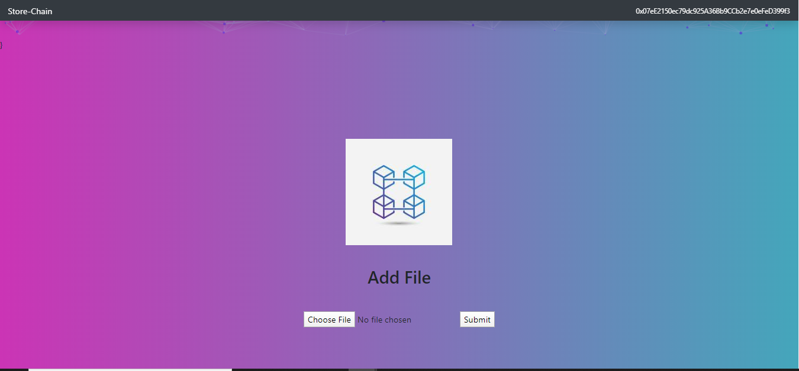
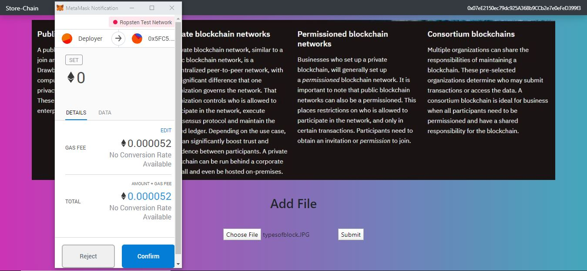

# Store-Chain

Store-Chain is a decentralized Ethereum and IPFS based record storage system. You can store any amount of your medical records or 
any other information on the distributed IPFS network. The data or record goes to the IPFS network and get distributed on the network, 
then the IPFS network returned a hash of the data and we store that hash onto the Ethereum network. 
We need crypto-wallet to do the transaction such as Metamask. 

## Dependencies

1. Currently this react Web App is deployed on Ropsten and Rinkeby test network. 
2. One of its dependency is to use metamask wallet with it. 

## For Test Ethers
Ropsten test-network faucet ==> https://faucet.ropsten.be/  \
Rinkeby test-network faucet ==> https://faucet.rinkeby.io/

<small>Home Screen</small>

<small>Sample Transaction</small>

